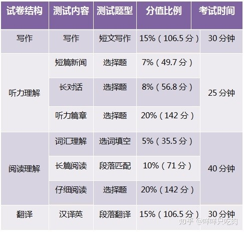

# CET 4

## 分值性价比

写作性价比 = 710 \* 15 % / 30 = 3.55

听力性价比 = 710 \* 35 % / 25 = 9.94

阅读性价比 = 710 \* 35 % / 40 = 6.21

翻译性价比 = 710 \* 15 % / 30 = 3.55

**由此可得：**

题目的性价比：听力 > 阅读 > 作文 > 翻译

提分简易程度：听力 > 阅读 > 作文 > 翻译

## 考场必备

- 准考证、身份证、学生证（缺一不可）。
- 2B 铅笔、橡皮、0.5mm 黑色中性笔。
- 考试专用耳机
