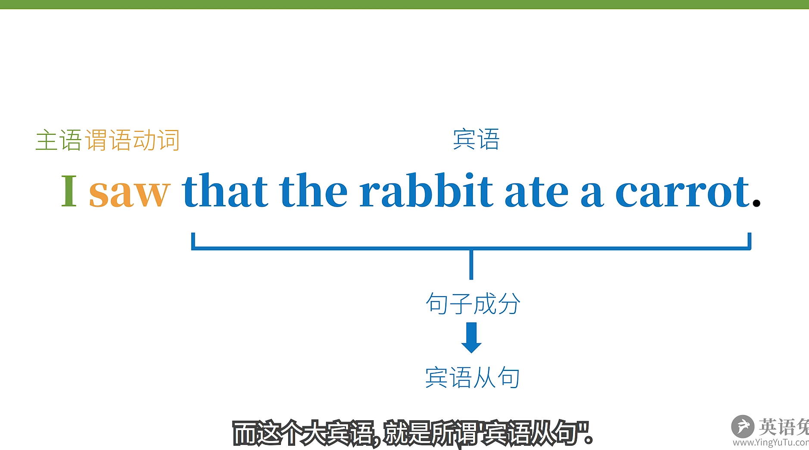

# 名词从句

## 主语从句

将简单句修改，使其可以充当另一个句子的主语。

- **The fact** is obvious. ——> **That the rabbit ate a carrot** is obvious. ——> **It** is obvious that **the rabbit ate a carrot**.

主语从句从都有引导词：that、whether、when、what、how 等。

- **That the hungry rabbit had already eaten a carrot for dinner this evening** is obvious.

这个句子显然头重脚轻了，因此得改为：

- **It** is obvious **that the hungry rabbit had already carrot for dinner the evening is obvious.**

这句话中的 It 指代的是 that the hungry rabbit had already carrot for dinner the evening。

## 宾语从句

将简单句修改，使其可以充当另一个句子的宾语。

- I saw **that the rabbit ate a carrot**.

### 宾语从句的引导词 that 往往可以省略

- I know the rabbit ate a carrot.

但有时候 that 也不可以省略：

- l didn't know **that** the rabbit atethe carrot and **that** you saw it.

### 否定词加在谓语动词前，而非从句中

- I don not think that the rabbit is smart.

而非：

- I don not think that the rabbit is not smart.

## 主从时态一致

主句的时态要和从句的时态一致。

- I didn't think that you were right.

## 表语从句

将简单句修改，使其可以充当另一个句子的表语。

- The problem is **that the rabbit is hungry.**
- The reason is **that there's no more carrot**.

### 主语从句和表语从句

表达的意思大致一致，区别在于强调的信息不一样。

- 主语从句：That the rabbit ate a carrot is a **secret**.
- 表语从句：**The secret** is that the rabbit ate a carrot。

### 系动词非 be 动词

- lt seems that the rabbit is hungry.
- lt feels that you're not telling the truth

## 同位语从句

将简单句修改，使其可以充当另一个句子的同位语。

- The **fact** that the **rabbit ate the carrot** did not surprise me.

## 宾语补语从句

将简单句修改，使其可以充当另一个句子的宾语补语。

- You can call **me what you like**
- My education made me **who I am today**.
