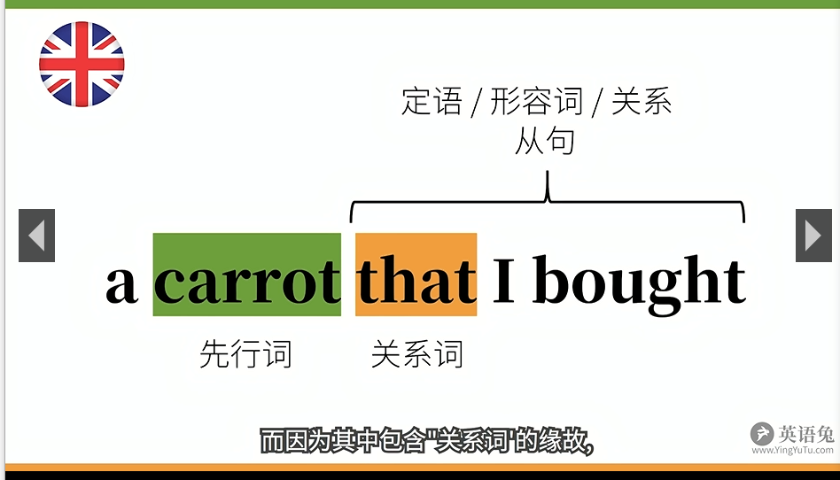
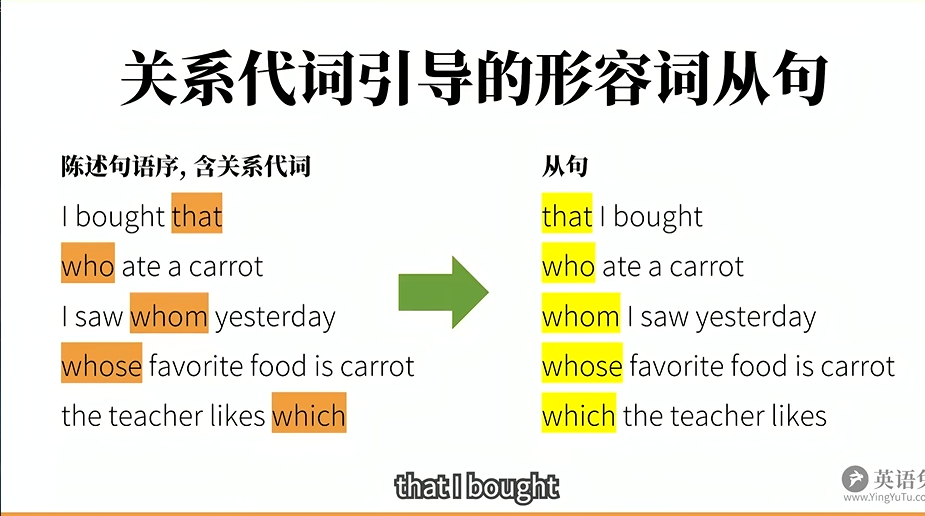

# 形容词从句

将简单句修改，使它成为另一个句子的定语。**也叫定语从句或关系从句**。

定语从句都是后置的。

从句由**先行词 + 关系词**，组成，关系词可以分为关系代词和关系副词。

- a carrot **that** I bought.

## 关系词

先行词 + 关系代词

**先行词是唯一的，用 that**.

- The rebbit ate **the largest** carrot that I've ever seen.
- **The only** rebbit that ate a carrot

**先行词多选一，用 which.**

- The rebbit ate a carrot which I bought.

## 关系副词

关系副词相当于**介词+关系副词**

where、why 、when

## 限定性形容词性从句

The rabbit ate the carrot **which was on the table**.

其中 **which was on the table **限定了 carrot 的范围，which 相当于 **the carrot**

## 非限定性形容词从句

The rabbit ate the carrot, which was on the table.

这句话表达了一前一后两个意思： The rabbit ate the carrot 和 which was on the table 。

### 非限定性形容词从句指代整句话

- The rabbit ate the carrot, which was not surprising.

which 指代 The rabbit ate the carrot

## 限定性和非限定性

- I have a head which is round.

我有好几个头，其中一个头是圆的。

- I have a head, which is round.

我有一个头，这个头是圆的。
