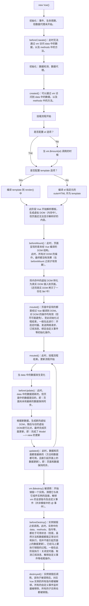

# 生命周期流程

```mermaid
flowchart TD;
   		newVue["new Vue()"] --> init["初始化：事件、生命周期、但数据代理未开始。"];
   		init --> beforeCraeate["beforeCraeate()：此时无法通过 vm 访问 data 中的数据，以及 methods 中的方法。"];
   		beforeCraeate --> againInit["初始化：数据检测、数据代理。"];
   		againInit --->created["created()：可以通过 vm 访问到 data 中的数据，以及 methods 中的方法。"];
   		created --> 挂载流程开始
   		挂载流程开始 --> el["是否配置 el 选项？"]
   		el -->|Yse| template["是否配置 template 选项？"];
   		el -->|No| $mount["当 vm.$mount(el) 调用的时候"];
   		$mount -->template;
   		template -->|Yes| compileTemplate["编译 template 到 render() 中"]
   		compileTemplate -->stageOne
        template -->|No|compileEl["编译 el 指定元的outerHTML 作为 template"];
        compileEl --> stageOne["此阶段 Vue 开始解析模板，生成虚拟 DOM（内存中），但页面还无法显示解析好的内容。"]
        stageOne --->beforeMount["beforeMount()：此时，页面呈现的是未经 Vue 编译的 DOM 结构。</br> 此时，所有对 DOM 的操作，最终都没有效果（在 beforeMount 之前才有效果）。"];
        beforeMount --> $el["将内存中的虚拟 DOM 转化为真实 DOM 插入到页面。（还将真实 DOM 拷贝了一份在 $el 中）"]
        $el --> mouted["mouted()：页面中呈现的都是经过 Vue 编译到 DOM。</br> 对 DOM 的操作均有效（但尽可能避免），至此初始化过程结束，一般在此进行：开启定时器、发送网络请求、订阅消息、绑定自定义事件等初始化操作。"]
        mouted --->mountEnd["mouted()：此时，挂载流程结束。更新流程开始"];
        mountEnd --> changes["当 data 中的数据发生变化"];
         changes --> beforeUpdate["beforeUpdate()：此时，data 中的数据是新的，但页面中的数据是旧的，即：页面尚未和最新的数据保持同步。"];
         beforeUpdate --> compareVNode["根据新数据，生成新的虚拟 DOM，随后与旧的虚拟DOM进行比对，最终完成页面更新，即：完成了 Model —> view 的更新"];
         compareVNode --> updated["updated()：此时，数据和页面都是最新的（方法和数据都可用，且能引起页面上的数据更新），即：页面和数据保持同步。"];
         updated --> mountEnd;
         updated ---> $destroy["vm.$destroy() 被调用：开始销毁一个实例。清理它与其它组件实例的连接，解绑 vm 的全部指令及自定义事件（并非模板中的 @ 事件）。"];
         $destroy --> beforeDestroy["beforeDestroy()：实例销毁之前调用。此时，实例中的 data、methods、指令等，都处于可用状态（但是，虽然方法和数据都能正常访问和执行，但并不能引起页面上的数据更新），</>已经马上要执行销毁的过程。一般在此阶段执行：关闭定时器、取消订阅消息、解绑自定义事件等收尾操作。"]
        beforeDestroy --> destroyed["destroyed()：实例销毁后调用。该钩子被调用后，对应 Vue 实例的所有指令都被解绑，所有的自定义事件监听器被移除，所有的子实例也都被销毁。"]
```
