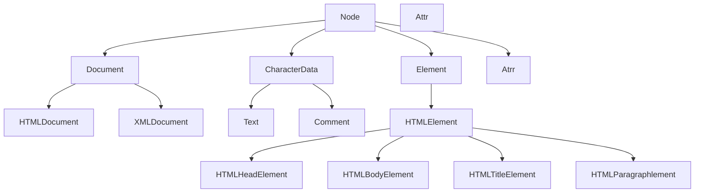

# DOM

DOM （文档对象模型）中提供了一系列的方法，DOM 是这一些列方法的统称。这些方法使得我们可以**操作 HTML 和 XML**。

DOM 就像一棵节点树一样，从文档的根（document），依次分支展开，每一个元素，都可以看作是树的一个节点，每一个元素都是一个对象。

使用 DOM 操作文档中的元素时，必须先加载整个 HTML 文档（body 之前的代码 ），再加载 JS 文件；因为没有完整的 DOM 模型，DOM 的一些操作就无法完成，会导致报错。



Node 最终指向 Object.prototype。

### getElementById()

getElementById() 定义在了 Document.prototype 上，这说明 XMLDocument 和 HTMLDocument 都能使用 getElementById()，但 Element 不能使用 getElementById()。

### getElementsByName()

getElementsByName() 定义在了 HTMLDocument.prototype 上，这说明 XMLDocument 和 Element 不能使用 getElementsByName()。

### getElementsByTagName()

getElementsByTagName() 定义在了 Docunment.prototype 和 Element.prototype 上，这说明 getElementsByTagName() 的兼容性最好，即文档中的元素也可以调用 getElementsByTagName()。

像这样：

```JavaScript
// document 可以调用 getElementsByTagName()，表示选择 document 中的 body 元素
var body = document.getElementsByTagName('body')[0]
// 同样的，body 也可以调用 getElementsByTagName()，表示选择 body 元素中的 div 元素
var div = body.getElementsByTagName('div')[0]

```

### HTMLBodyElement 与元素的关系

```JavaScript
// 只有 body 元素的方法继承自 HTMLBodyElement.prototype
HTMLBodyElement.prototype.fun = '自定义方法'
// 通过 body.fun 可以调用我们自定义的 fun 方法
var body = document.getElementsByTagName('body')[0]
// 而 head 元素并没有 head.fun 方法，因为 head 元素不属于 HTMLBodyElement
var head = document.getElementsByTagName('head')[0]

```

### HTMLElement 与元素的关系

```JavaScript
// 任何元素的方法都继承自 HTMLElement.prototype
HTMLElement.prototype.fun = '自定义方法'
// head 和 body 元素都可以使用 fun()
var body = document.getElementsByTagName('body')[0]
var head = document.getElementsByTagName('head')[0]
```
