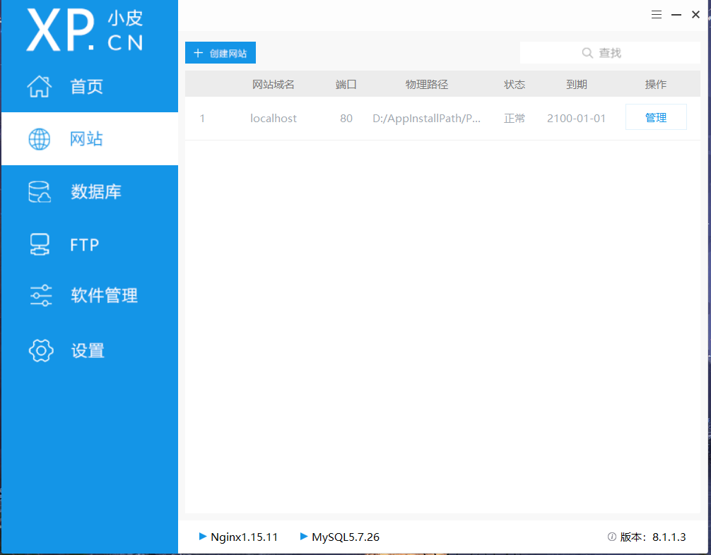

# 环境配置

## 下载 [PHPStudy](https://www.xp.cn/download.html)

PHPStudy 是一个 windows 下的 Apache/Ngnix+PHP+MySQL 的**集成开发环境**

1. 解压运行
2. 选择安装目录，通常时 D 盘，我这里是**D:\AppInstallPath\PhpStudy**

安装完成后，打开 PHPStudy，会出现以下界面：



另外，PHPStudy 会在安装目录下的 **phpstudy_pro\Extensions** 路径形成目录结构：


在这里我们只需要注意 MySql 和 php 的路径，因为之后我们会用到这两个路径来配置环境变量。

## 配置 MySQL 环境变量

1. 此电脑 — 系统属性 — 高级系统设置 — 高级 — 环境变量 。
2. 找到系统变量中名为 Path 的变量， 新建，将 MySql 目录下的 bin 文件的路径粘贴到这里，确定。
3. win + R 打开 cmd，输入 mysql，如果提示`ERROR 2003 (HY000): Can't connect to MySQL server on 'localhost' (10061)`就说明 MySQL 的环境变量配置完成。


## 创建站点

回到 PHPStudy，启动 MySQL 和 Apache（或者是 Nginx），配置网站的域名和端口，以及根目录。通常默认就 OK。

打开浏览器，在地址栏输入**localhost:80**，出现以下内容即为配置成功。


## 我的第一个 PHP 程序

接下来，我就可以开始编写 PHP 代码了，注意，我这里用的是宇宙第一编辑器 VS Code。

### 配置 PHP 环境变量

依旧是向之前那样找到名为 Path 的变量，然后添加 php 的安装路径，我这里的路径为**D:\AppInstallPath\PhpStudy\phpstudy_pro\Extensions\php\php7.3.4nts**

依旧打开我们的 cmd，输入`php -v`，出现以下内容即为配置成功：


### 安装 VS Code 扩展

打开我们的 VsCode，安装名为 PHP Sever 的扩展：


安装完插件后，我们新建一个后缀为 php 的文档，输入以下内容（内容随便）：

```php
<!DOCTYPE html>
<html>

<body>

    <?php
    echo "又是熬夜赶作业的一天！shit！";
    ?>

</body>

</html
```

鼠标右击**PHP Server: Serve project**


之后会跳转到电脑的默认浏览器，并打开一个页面，出现以下内容：


OK，我们的第一个 PHP 程序就成功拿捏了！
