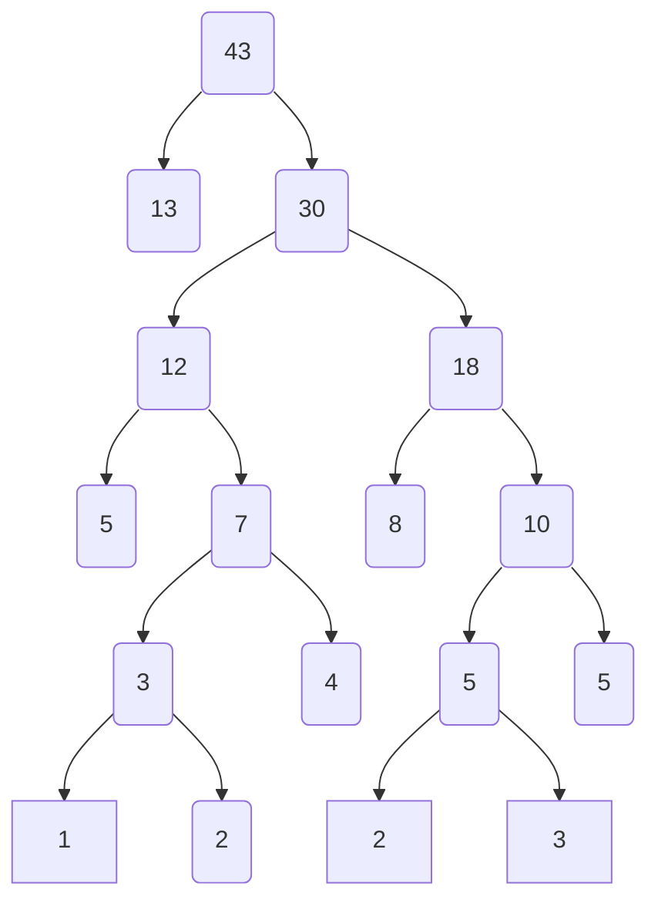

## 选择

1. A
2. D
3. A
4. D
5. A
6. C

## 填空

1. 正确性，可读性，健壮性，高效性。
2. 冒泡排序、插入排序、选择排序、希尔排序。
3. 8，64
4. 7

## 应用

### 简单排序的结果

1. 第一趟：22 80 48 40 45 78
2. 第二趟：22 40 48 80 45 78
3. 第三趟：22 40 45 80 48 78
4. 第四趟：22 40 45 48 80 78
5. 第五趟：22 40 45 48 78 80
6. 第六趟：22 40 45 48 78 80

### 构建哈夫曼树

### 图的遍历

深度优先遍历

1 ——> 2 ——> 3 ——> 6 ——> 5 ——> 4 ——> 7 ——> 8

广度优先遍历

1 ——> 2 ——> 4 ——> 3 ——> 5 ——> 6 ——> 7 ——> 8

### 树的遍历

先序遍历：根左右

A ——> B ——> C ——> D ——> E ——> F ——> G ——> H ——> I ——> J ——> K

中序遍历：左根右

C ——> B ——> E ——> D ——> G ——> F——> H ——> A ——> J ——> I ——> K

后序遍历：左右根

C ——> E ——> G ——> H ——> F ——> D ——> B ——> J ——> K ——> I ——> A

## 简述题

### 栈与队列相同点和不同点

**相同之处**

1. 都是线性结构。

2. 插入操作都是限定在表尾进行。

3. 都可以通过顺序结构和链式结构实现。

4. 插入与删除的时间复杂度都是`O(1)`，在空间复杂度上两者也一样。

5. 多链栈和多链队列的管理模式可以相同。

**不同之处**

1. 删除数据元素的位置不同，栈的删除操作在表尾进行，队列的删除操作在表头进行。

2. 应用场景不同；常见栈的应用场景包括括号问题的求解，表达式的转换和求值，函数调用和递归实现，深度优先搜索遍历等；常见的队列的应用场景包括计算机系统中各种资源的管理，消息缓冲器的管理和广度优先搜索遍历等。

3. 顺序栈能够实现多栈空间共享，而顺序队列不能。

4. 栈先进后出，队列先进先出
   

### 排序的基本概念

排序就是将一个任意序列的一组数据，按某个关键字，重新排列为有序的序列。

### 数据结构的定义

数据结构是指计算机**存储和组织数据的一种的结构**。

将现实中大量而复杂的问题以特定的数据类型和特定的存储结构存储到内存中，以此来实现某个功能（删除、查找、排序）而执行相应的操作，这个相应的操作也叫算法。

数据结构定义数据将以什么样的形式存储到内存中，而算法定义的是我们如何对内存中的数据结构进行操作。

**程序 = 数据的存储（数据结构） + 数据的操作（算法） + 可以被程序执行的语言（变成语言）**